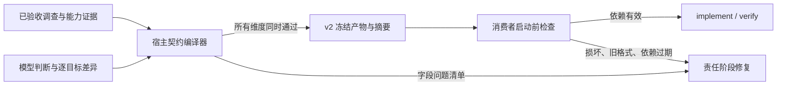

# 宿主分层循环执行模式

`execution_mode: hierarchical` 把执行控制权从自由运行的根 Agent 移到宿主状态机。知识雪球仍负责传承认知，但不再兼任任务计划、当前目标或完成声明。

## 循环层级

1. Goal Loop：保存用户原始目标、来源和 Definition of Done。
2. Requirement Loop：planner 一次建立稳定 R-ID 账本；每个 R-ID 对应一个可独立验收的结果。
3. Phase Loop：每个 R-ID 纵向经过 `investigate → prepare → implement → verify → close`，关闭后才进入下一个 dependency-ready R-ID。
4. Action Loop：宿主直接启动当前阶段角色；角色只获得本阶段的 prompt、Skill 契约和工具能力。
5. Recovery Loop：契约错误按结构化诊断中的责任阶段调度，不按报错阶段或中文文案猜测；同一责任阶段/错误代码的累计预算跨阶段保留。尚未迁移的工具与执行错误仍使用兼容恢复规则。累计上限是最后的熔断保护，不承担判断错误归属的职责。

这些层级会投影成宿主持有的 work graph，而不是让模型在文本里模拟流程图。图节点表示 alignment batch、planner、requirement phase、动态 capability、acceptance 和 integration；依赖边决定可运行节点，证据与工作区 revision 决定节点是否仍然有效。现阶段仍按 requirement 纵向串行调度以保持兼容，但调度器已从固定 `if/else` 阶段链切换为 dependency-ready 图选择，后续可以在不改阶段交接契约的前提下安全开放无冲突节点并行。

所有 R-ID 和工作单元 ID 都与知识 revision 解耦。知识更新只增加或校正事实，不会把 `knowledge-r59` 变成新的任务目标。
调查中发现遗漏的独立结果时，只能追加新的 R-ID，不能替换或重编号既有账本。

## 阶段交接与观察新鲜度

每个阶段在角色启动前声明模型需要提交的字段，并把对应 JSON Schema 交给 StructuredOutput。模型输出是待编译的提案，不等于可供下游执行的阶段产物；宿主生成机械字段、验证完整契约后，才原子提交 `phase_artifact`。连续图片按三个新页面一批读取，并从第二批开始携带上一批末页作为只读衔接上下文；这样跨页表头和续行不会因为批次硬切而被错误地重新编号。planner 必须先利用重叠页和编号连续性裁决附件冲突，不能把互斥页面目标合并成一个需求后转嫁给代码调查。

阶段输出被拒绝时，宿主会保留一份有界的结构化草稿和最近几条不同的拒绝原因，下一次角色直接在草稿上定向修正。这样后一个校验的修正不会重新引入前一个校验已经指出的问题，也不需要重新读取已完成的只读证据。第三方模型轻微拼错 `StructuredOutput` 工具名时，只要参数对象仍完整，宿主会恢复该对象并执行同一套语义校验，不会绕过阶段契约。

行为义务通过稳定 obligation ID、允许状态和 path:line 证据闭环。`observed_behavior` 用于描述最终代码观察，不与 `required_behavior` 做自然语言逐字相等；语义是否满足由独立 verify 根据代码证据判定，实质不符必须返回 fail。这样既保留目标、参数、guard 等冻结契约，也不会因同义改写回滚正确实现。

- investigate：确认事实、目标位置、相似实现、开放未知；
- prepare：调用契约、修改前行为、保留不变量、最小补丁计划、验证计划；
- implement：实际改动、diff 摘要、即时检查、已保留不变量；
- verify：验证摘要、回归检查、未解决风险和逐项 acceptance 结果。

交接物携带 `workspace_revision`。与当前工作区版本一致时标记 fresh，可复用语义结论，但不能跳过 Edit 的旧内容匹配或实时验证；代码提交后旧观察自动降为 historical，只能作为修改前基线。宿主不缓存原始文件内容或任意命令结果，最终 diff、语法检查和测试始终实时执行。

## 行为契约编译与依赖修复（v2）

R33 暴露的根因是职责重叠：同一份 JSON 同时被当作模型答案、宿主回填容器和下游执行契约。prepare 可以保存文字，verify 又要求机器信封；verify 无权修改 prepare 产物，却不断被重试或退回 implement。

现在只有 `compileHierarchicalPrepareBehaviorContract` 一个发布入口。它收集已验收 investigate/capability 的事实，调用纯函数 `compileBehaviorContract`，成功后才写入 handoff。原有三段可互相覆盖的行为回填流程已删除。



模型只拥有 `dimension / decision / reason / changes`。例如新增别名所需的前置条件差异提交：

```json
{
  "dimension": "preconditions",
  "decision": "intentional-difference",
  "reason": "当前需求明确增加该入口别名",
  "changes": [{
    "target_key": "route",
    "value": ["linkType == 'nativeLink'", "pageName == 'YQBhome'"],
    "evidence_refs": ["routes.js:77"]
  }]
}
```

示例只说明提案格式，实际 `value` 必须基于该目标的参考事实与需求。未列出的目标保留原行为；模型不再复制 ID、版本号、参考信封、完整目标集合。旧 `required_behavior` 只作为历史草稿的输入兼容格式，不能用普通文字替代差异。

编译器一次检查六个维度、目标覆盖、重复项、差异形状和证据，所有问题一并返回。它不修改失败的提案；成功产物包含来源调查 ID、引用证据、宿主生成的义务 ID、参考/期望值和内容摘要。原 `behavior_obligations` 是兼容视图，由产物派生，不再独立写入。摘要用于一致性检查，不是数字签名。

参考事实明确区分 `source` 和 `review`。只有源码分析器实际提供的指纹参与自动源码比对；人工/模型调查的跨语言事实继续由 verifier 审查。`null` 表示未知或未观察到，绝不自动转换为“无 guard”或“无副作用”，也不构成通过证据。

implement/verify 的 SDK 调用和文件快照之前，宿主用同一读取校验器检查产物摘要、来源调查 ID、六维完整性及派生视图一致性。旧格式会交回 prepare 重编译，不能静默迁移为可信机器事实，也不会先启动消费者反复读文件。

契约诊断持久化为 `code / owner_phase / artifact_id / issues[{path,message}]`。错误代码与责任阶段形成稳定失败身份，改文案、换工作单元或产物修订不会清零累计预算。结构错误归 prepare，缺少调查证据归 investigate，源码与已冻结计划不符归 implement；`already_satisfied` 声明不成立时归 prepare。恢复给责任阶段的是生产者自己的提案视图，而非消费者的失败报告。调查和模型语义判断仍可能错误，本设计保证的是协议一致性、证据边界和可终止的恢复路径，不替代业务验收。

## 修改事务与自愈

prepare 签发规范化的项目相对文件租约。implement 启动前，宿主快照这些文件：

- 现有文件禁止整文件 Write，只能最小 Edit；Write 仅用于创建新文件；
- implement 失败、异常退出、删除既有文件或导致大文件异常缩减时，只恢复本工作单元开始前的快照；
- 快照包含此前已完成 R-ID 的累计修改，因此自愈不会恢复到 develop 或覆盖用户原有工作；
- 分支、HEAD、stash/reset/restore 属于 Goal 级工作区契约，叶子角色不得重复执行。

`prepare.call_contract.analyzed_targets` 只描述真实函数、方法、类或组件的调用契约，不要求和 `allowed_files` 一一对应。常量表、路由配置、静态数据和样式文件只进入 `allowed_files`、`patch_plan` 与修改前证据，避免为了满足文件覆盖而伪造手工符号分析。

同功能参考按每个原始页面/协议 token 建立独立 `target_key`，并明确拆成三层关系：`dispatcher_location` 是公共分发器或配置消费点；`location` 是既有入口中真正发生调用、回调注册或导航提交的源码行，`entry_symbol@entry_location` 是拥有这条调用边的函数、方法或组件；`contract_symbol@contract_location` 是沿该边到达的最终页面组件或业务函数。路由常量和静态配置只能作为检索证据，不能冒充入口调用契约；公共分发函数也不能冒充最终组件。prepare 必须逐目标调查入口符号的出向调用和最终符号的定义/引用，并让六类行为义务的 `target_keys` 覆盖全部目标。`changes_required` 描述的是尚待实现的未来契约，不得要求不存在的新分支提供当前代码行；目标现状和修改上下文由 investigate 交接物证明，实际目标代码证据由 implement 与 verify 在修改后逐项提交。只有 `already_satisfied` 才需要在 prepare 同时证明当前目标已满足每项义务。

`investigate` 只有在 `open_unknowns` 为空时才能通过。参考入口与最终契约还必须来自任务 Git 基线；工作区或前序需求刚新增/改写的代码不得反向充当“既有同功能实现”。若仓库证据无法裁决且不同答案会改变用户可观察行为，应返回 `blocked + user_decision`，不能猜测目标组件。

investigate 在目标由业务功能、用户行为、页面、事件或协议值描述时，必须调用宿主持有的 `locate_feature_implementation` 功能普查脚本。脚本对 JavaScript/TypeScript/React/Python/Java 源文件做词面普查：JS/TS 对独特证据文件执行受限语义分析和两跳调用图，Python/Java 索引函数、方法、类、定义范围及词面调用位置。候选合并符号名、文件路径、定义正文和配置邻接证据，并逐项记账为 yes/no/unknown。首次报告中的 unknown 必须由 AI 读取完整定义、检查每个位置并携带 path:line adjudication 重跑；宿主按真实 tool call、报告 digest、候选计数和最终 yes 集合重算校验，Read/Grep、候选排名或模型自述不能替代。Python/Java 的词面调用不冒充精确绑定，prepare 前再由 Pyright/JDT LS capability 确认 Call Hierarchy。不支持的其他语言中命中功能证据时报告保持 partial，不允许静默漏掉。

prepare 对真实函数、方法、Hook 或组件使用宿主持有的语言分析 capability。investigate 一旦确认最终 `contract_symbol@contract_location` 和所选参考的 `entry_symbol@entry_location`，宿主就在 prepare 前分别动态展开“最终契约”和“参考入口”符号节点；入口节点的出向边负责保留参数、guard、上下文和副作用，最终节点负责确认真实定义及其引用。节点有自己的角色标记、输入、attempt、错误指纹、证据、输出和 workspace revision。某个符号失败时只重试该节点，不再重启整个 prepare 角色；若 prepare 发现历史 handoff 缺少入口元数据或真实出向边，第一次失败就直接退回 investigate 扩图，不会在 prepare 连续空转六次。

- JavaScript/TypeScript 使用内建精确分析器：自动消费 contract、calls、wrappers、references、effects 全部分页，递归调查公共封装，并守恒核对全部引用；动态引用必须闭合或进入 `unresolved`。
- Python 在 `AI_CODER_PYRIGHT_LANGSERVER` 或 PATH 中 `pyright-langserver` 可用时使用标准 LSP Call Hierarchy。
- Java 在 `AI_CODER_JDTLS` 或 PATH 中 `jdtls` 可用时使用标准 LSP Call Hierarchy。
- Python/Java 外部语言服务器不可用时，使用明确标记为非精确的源码词法调用点普查：枚举同名调用形态并逐点交给 AI 裁决，但不声称已经证明重载、继承、作用域或 import 绑定；所有结果保留 unresolved 与运行时验证边界。其他尚无适配器的语言才改走有 path:line 证据的手工静态分析。

Pyright/JDT LS 不只读取目标的一跳 caller/callee。宿主以目标为根递归展开 Call Hierarchy，默认深度 2、最多 100 个重载感知符号；节点按 URI、符号名、选择范围和 detail 去重，循环边只记一次。报告同时保存唯一节点/边、已展开节点数、深度/符号上限和截断原因。达到上限、子节点查询失败或图未闭合时状态为 `topology-bounded-with-semantic-unknowns`，相关原因进入 unresolved，不能宣称完整。递归包装链上的每个有位置调用边都会成为独立逐调用点 AI 调查节点。

`inspectLanguageAnalysisAvailability` 提供只读诊断：分别报告内建分析器、外部 LSP 可执行文件解析和词法兜底，并给出每种扩展名实际选择的路由与是否降级。外部命令存在只标记为 `pending-target-probe`；只有具体 capability 对当前工作区执行 initialize、prepareCallHierarchy 和递归查询后，才形成目标级集成证据。

符号节点通过后不会直接放行 prepare，而是从宿主报告生成守恒的 `callsite_inventory`，再为每个调用位置动态展开一个依赖该符号节点的 `callsite-semantic-review` AI 节点。每个节点只接收一个调用点的有界源码片段、该调用边目标定义的有界源码片段、精确 path:line、调用拓扑和可用的静态行为指纹；宿主持有 evidence、源码摘要和 digest，模型不再重复回填这些机械字段，从而同时防止串包和降低 StructuredOutput 出错率。节点只提交 destination、invocation、arguments、preconditions、context、side_effects 六维语义结论；证据不足必须标记 unresolved，不能猜测。源码片段按不可信证据处理，其中的注释和字符串不能改变调查指令。

所有调用点节点完成后，宿主按 `callsite_id` 回填 `analyzed_target.callsite_reviews`，并生成 `callsite_accounting`。`total = reviewed = relevant + irrelevant + unresolved` 且 ID 集合与符号节点清单完全一致时，prepare 才能通过。这样“找到目标组件”与“证明它在每个真实入口中怎样被调用”成为两个独立、可重试、可审计的图层，避免只看定义而漏掉参数、登录/实名 guard、上下文透传或业务函数调用方式。

LSP Call Hierarchy 只冻结定义、入向调用和出向调用拓扑，不声称已经证明实参表达式、默认参数、guard、鉴权、状态读写或副作用。宿主把这些边界强制写入 `unresolved`，并要求 `runtime_verification_required=true`；逐调用点节点审查宿主截取的源码上下文，prepare 再汇总定义、调用点和未决边界。因此多语言扩展增加的是可靠检索与关系证据，不会把关系图误当成完整程序行为。

只读阶段仍向 SDK 暴露受宿主门禁保护的 `Edit`/`Write` 名称。过早调用不会得到“工具不存在”，而会得到当前阶段应提交什么、何时自动进入 implement 的修正指引。Bash 写入同样按阶段返回下一步。旧 Profile 的任务树和 checkpoint 工具不再进入分层角色的 SDK 工具面，并同时列入禁用清单；旧会话或异常 provider 仍发出这类调用时，边界处理只作兼容性引导。`ask_human` 不能用于申请内部工具，因此不会把宿主格式问题转成用户问题。

## 阶段角色与能力

| 阶段 | 角色 | 写权限 | 核心 Skill |
| --- | --- | --- | --- |
| align | task-planner | 无 | clarifying-requirements、exploring-codebase、task-decomposition |
| investigate | code-investigator | 无 | exploring-codebase |
| prepare | implementation-preparer | 无 | preserving-existing-behavior、investigating-call-contracts |
| implement | task-executor | 仅 prepare 签发的文件租约 | preserving-existing-behavior、safe-git-operations |
| verify | task-verifier | 无 | verification-before-completion |
| integrate | completeness-checker | 无 | verification-before-completion |

阶段角色不持有 `Task` 或 `ask_human` 工具。宿主根据 typed blocker 决定是否询问用户；只有 `user_decision` 和 `external_resource_missing` 且 owner 为 user 时可以提问。

## 完成条件

只有同时满足以下条件，会话才进入 `completed`：

- 稳定需求账本非空；
- 每个非 skipped R-ID 均已关闭；
- 每个验收项都有独立验证证据且状态为 PASS；
- 没有开放 blocker；
- 全局 completeness 审计通过并保存证据。

全局审计若发现某个已关闭 R-ID 仍有缺口，会把它退回 investigate/prepare，并使依赖它的已完成需求验收失效；不会原地重复审计。

## 工作流配置

```yaml
id: careful-coder
execution_mode: hierarchical
stages: []
```

不配置 `execution_mode` 的旧 Stage/Profile 工作流继续走原路径，便于逐步迁移和回滚。
